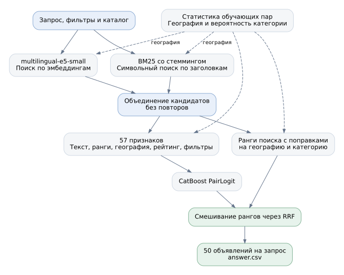

# Поиск объявлений для Авито

По запросу и фильтрам нужно найти до 50 объявлений. В [solution.ipynb](solution.ipynb) разобраны данные, ограничения текстового поиска, обучение ранкера и добавление поиска по смыслу. Выбранная модель получила **Recall@50 = 0.8452** на 800 запросах локального test, параметры выбраны по val.



BM25 использует заголовок, параметры и описание. Стемминг объединяет формы слов, символьный поиск по заголовкам помогает с вариантами написания. E5 без дообучения добавляет объявления, близкие запросу по смыслу. CatBoost PairLogit отбирает ответ по 57 признакам, среди них текстовые оценки и ранги, совпадения в отдельных полях, география, вероятность категории, рейтинг, отзывы и фильтры. Оценка ранкера смешивается с поисковым рангом.

Разбиение сделано по нормализованным текстам запросов. Для каждого сравнения отложены 800 val и 800 test. После разбора test следующая серия использует новые тексты, поэтому числа разных серий напрямую не сравниваются. География и вероятность категории для обучающих примеров рассчитаны по другим фолдам. Все известные позитивы одного текста исключены из негативов, а не найденные поиском позитивы остаются в знаменателе Recall.

При разборе данных оказалось, что часть кодов локаций запроса отсутствует в каталоге. Вместо жёсткого фильтра используется статистика переходов между локациями из train. Ошибки буквального поиска частично исправило добавление E5. Если у выбранной модели оставить только прежние текстовые кандидаты, Recall падает до 0.8294. На запросах без локации в каталоге результат с E5 ниже, 0.7357 против 0.7679. Интервал разницы включает ноль, поэтому этот срез оставлен как ограничение и гипотеза для следующей проверки.

## Запуск

В репозитории уже есть данные, веса и промежуточные массивы. Большие файлы хранятся в Git LFS. Данные и артефакты занимают около 4 ГиБ, с локальной копией LFS потребуется около 8 ГиБ. Обычный Run All проверен с Python 3.10 на Linux, CPU и 16 ГБ RAM.

```bash
git lfs install
git clone https://github.com/palmaus/avito_nlp_test.git
cd avito_nlp_test
python -m venv .venv
source .venv/bin/activate
pip install -r requirements.txt
jupyter lab solution.ipynb
```

Для существующей копии достаточно `git lfs pull`. После установки зависимостей и получения файлов интернет для расчётов не нужен.

```bash
python run.py predict
```

Команда создаёт `answer.csv` с 2452 строками по 50 объявлений. `python run.py evaluate` пересчитывает локальные метрики. Другую модель можно указать через `--model`, например `python run.py predict --model model/e5_features.cbm`. Число признаков определяется по весам.

В notebook доступны три режима.

| Режим | Что пересчитывается | Время на CPU |
|---|---|---|
| Обычный Run All | Предсказания, подбор по val, метрики, графики и ответ | 12 мин 9 с в последнем проверочном запуске |
| `TRAIN = True` | Дополнительно обучение на приложенных примерах | В исходном запуске около 6 минут на один ранкер с E5 |
| `REBUILD = True`, `TRAIN = True` | Кандидаты, эмбеддинги, признаки и обучение | Только кодирование 514766 уникальных текстов заняло порядка 3 часов на моём компьютере (CPU); benchmark, запросы, поиск и признаки потребуют дополнительного времени |

Новые результаты сохраняются в `cache/` и имеют приоритет при следующем запуске с выключенными переключателями. Для возврата к приложенному варианту можно переименовать `cache/`. При изменении данных, настроек или encoder загрузка несовместимого кэша остановится с просьбой пересчитать его. Отдельные наблюдения в Markdown относятся к сохранённому запуску, таблицы и выбранные параметры вычисляются заново.

`python run.py train --family e5` повторяет обучение выбранного подхода. Его веса можно проверить командой `python run.py evaluate --model cache/model/ranker.cbm`. Пересчёт признаков из командной строки включается через `--rebuild`. После выбора по val в notebook `predict` по умолчанию берёт `cache/model/answer.cbm`, а при его отсутствии приложенный `model/ranker.cbm`.

## Сохранённые файлы

| Путь | Назначение |
|---|---|
| `data/` | Исходные train, каталог и запросы benchmark |
| `model/text_35.cbm`, `model/text_57.cbm` | Сравнение признаков первого ранкера |
| `model/text_57_reference.cbm` | Текстовый контроль на последнем разбиении |
| `model/ranker.cbm`, `model/e5_features.cbm` | Кандидаты E5 с 57 и 66 признаками; выбран первый вариант |
| `artifacts/search/`, `artifacts/geography/` | Кандидаты ранних сравнений |
| `artifacts/text_ranker/`, `artifacts/holdout*/`, `artifacts/benchmark*/` | Признаки первого ранкера, последней проверки и ответа; суффикс `_text` означает только текстовых кандидатов |
| `artifacts/training/` | Обучающие примеры по трём фолдам для соответствующих моделей |
| `artifacts/encoder/`, `artifacts/embeddings/` | ONNX и токенизатор E5, эмбеддинги объявлений |

В каждом блоке признаков `core.npz` содержит кандидатов и 35 базовых столбцов, `fields.npz` добавляет 22 признака полей, `embedding_features.npz` ещё 9 признаков E5. `query_rows.parquet` задаёт строки запросов, `item_ids.npy` порядок каталога, `query_embeddings.npy` содержит именно векторы запросов. Файлы `.key` связывают эмбеддинги с текстами и encoder.

Расчёты вынесены в `src/`. Тестовые проверки разбиений, негативов, кэша и предсказаний запускаются через `python -m unittest test_solution.py`.

Разметка содержит только известные положительные пары.

Используется [multilingual-e5-small](https://huggingface.co/intfloat/multilingual-e5-small/tree/614241f622f53c4eeff9890bdc4f31cfecc418b3)
